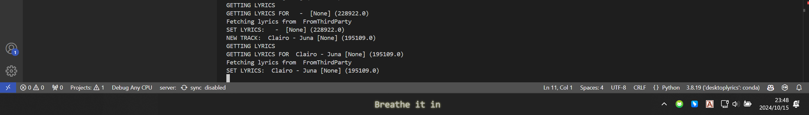

# LyricBar: <small style="color:grey">Minimal ~~Desktop~~ Taskbar Lyrics For *(Mainly)* Spotify </small>

- ***UNDER DEVELOPMENT (maybe)***
- ***Only tested on my own pc. Can be buggy.***
- **You can still tweak it to make it like a normal draggable lyrics widget though**
- <span style="color:red; font-weight:bold;">Also works for other music players! (Though I didn't try many...)</span>
- **VERY PRETTY!**


| Overview |
|:----------:|
| **Song/Artist Level Theme Customization** |
| 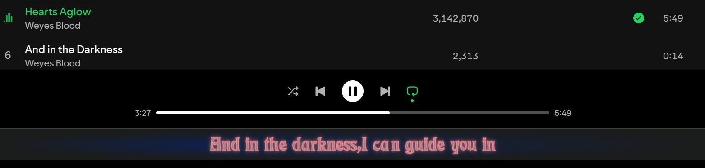 |
| **Easy Offset Setting & Auto Hide** |
| 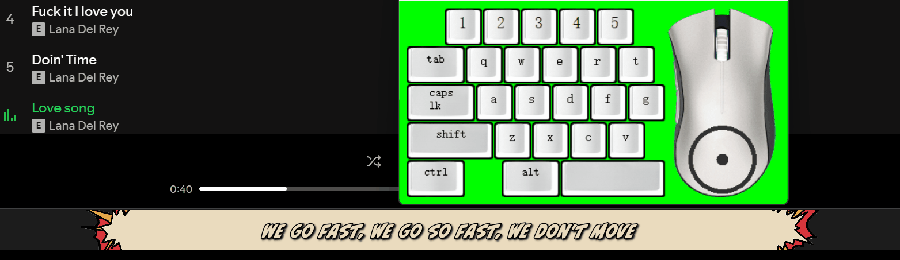 |
| **Lyrics Line Filter & Reformat** |
| 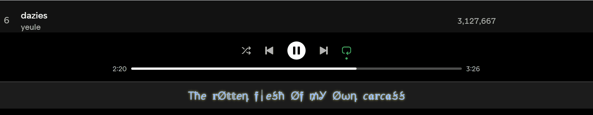 |
| **Sufjan Stevens** |
| 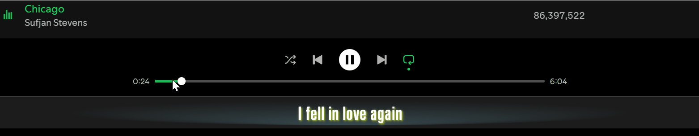 |

## Usage

### Setup

#### (Optional) Spicetify Setup
- With Spicetify, we can directly get playback information from desktop app, which provides much more precise information.
- Installation of Spicetify: [Refer to this.](https://spicetify.app/docs/advanced-usage/installation/)
- Add [this modified webnowplaying extension](webnowplaying.js) to the extension folder and then update and apply the config. [Refer to this.](https://spicetify.app/docs/advanced-usage/extensions)

#### LyricBar Setup

```
pip install -r requirements.txt
(proxy setting)
python ./main.py
```

### Configuration
- [Global Settings](LyricBar/globalvariables.py)
- [Themes](LyricBar/stylesheets.py)

### Control

| Key | Function |
|:---:|:--------:|
| Ctrl + Mouse Hover | Keep the lyrics widget open |
| Mouse Left Button | Copy current line |
| Mouse Right Button | Switch to next lyrics provider |
| Scroll Up/Down | Adjust track lyrics offset |
| Shift + Scroll Up/Down | Adjust global lyrics offset |

- It should be noted that the song progress from WRT may **be within 0-1 second error**, so you probably need to adjust global offset every run. If this bothers you then maybe you should use **Spicetify** as playing information provider, or switch to other spotify-API-based desktop lyrics.

## Theme 

- Currently Available Options:
    - Rule: Themes selection based on artist / track
    - Font:
        - Font Family
        - Font Weight
        - Font Color
        - Font Size
    - Outline:
        - Outline Color
        - Outline Width
    - Shadow/Glow:
        - Shadow/Glow Color
        - Shadow/Glow Offset
        - Shadow/Glow Radius
    - Background:
        - Background Color
        - Background Image
    - Entering Animation:
        - Fade in
        - Zoom in
    - Line Formatter

### Screenshots

| Default |
|:-------:|
| 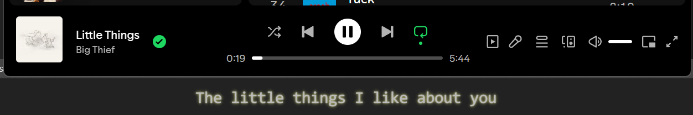 |

| Example 1 | Example 2 |
|:-----------:|:-----------:|
| 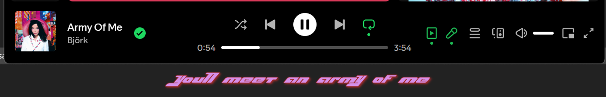 | 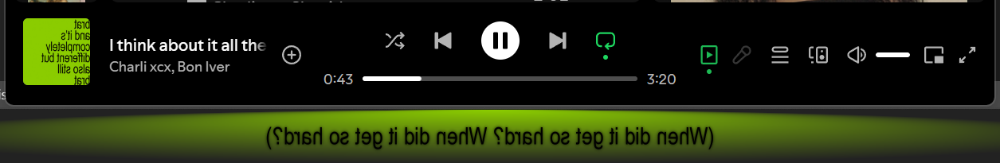 |
| **Example 3** | **Example 4** |
|  | 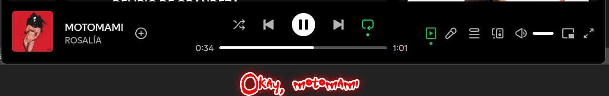 |
| **Example 5** | **Example 6** |
| 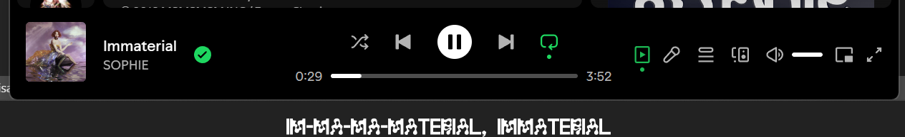 | 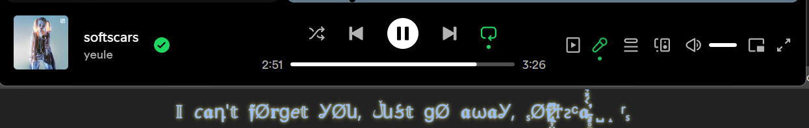 |

- *Font not provided*


## Updates

- 20241026
    - Add support for Spicetify, mmmmmuch more precise playback information now!
    - Fix syncedlyrics
- 20241022
    - Much more stable display:
        - Auto-hiding when no music is playing
    - Lyric searching no longer block the whole program
- 20241015
    - AutoHide: Stay on top of taskbar, hide when mouse hover
    - LyricsCopy: Hold ctrl when entering to copy the lyrics!
    - DefaultMode: Default mode does not need spotify API nor spotify lyrics API now!
    - LyricsCustomization:
        - Supports artist/song level customization
        - Supports line re-edit
        - Style Customization
            - font
            - background
            - entering animation
- 20241012
    - Can stay on top of taskbar now
    - Spotify API is only called to get track id for more precised lyrics matching, playback information is handled with winsdk now


## Todo

- [x] Hide when hovered
- [x] Option for match lyrics without track id
- [x] Lyric lines filtering
- [x] Lyric customization
- [x] Searching lyrics blocks the whole program ....
- [x] Display behavior is not very stable (?)
- [x] Fix Musixmatch lyrics searching
- [x] Get better syncing with Spicetify?
- [ ] Long lyrics line scrollllllllllll
- [ ] Better theme management
- [ ] Peek lines without changing offset
- [ ] Visual feedback to actions
- [ ] Pack It Up! 


## Made With
- PyQt5
- pyautogui
- pillow
<!-- - [syrics](https://github.com/akashrchandran/Syrics)
- [spotipy](https://github.com/spotipy-dev/spotipy) -->
- [pylrc](https://github.com/doakey3/pylrc)
- [winsdk](https://github.com/pywinrt/python-winsdk)
- [Spicetify](https://spicetify.app)

## With Reference To
- [This stackoverflow post](https://stackoverflow.com/questions/64290561/qlabel-correct-positioning-for-text-outline)
- [This stackoverflow post](https://stackoverflow.com/questions/79080076/how-to-set-a-qwidget-hidden-when-mouse-hovering-and-reappear-when-mouse-leaving)
- [Py Now Playing](https://github.com/ABUCKY0/py-now-playing)