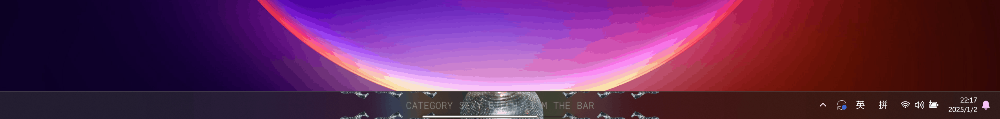
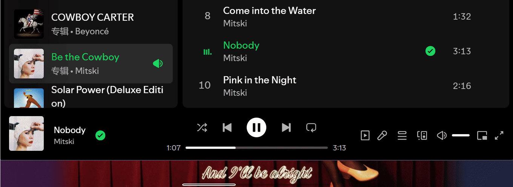

<div align="center">
  
#  LyricBar

*<p style="color:grey">Taskbar Lyrics For Spotify and More</p>*

</div>

----
## ✏️ Notes

- UNDER DEVELOPMENT (maybe)
- Only tested on my own pc. Can be buggy.
- <span style="color:red; font-weight:bold;">Also works for other music players! (Though I didn't try many...)</span>
- Lightweight and PRETTY!

----

## ⭐ Features

- Dock at taskbar, hide automatically when mouse enter or no media is playing
    
- Easy lyrics source management and track / global syncing offset setting
    
- Track / Artist level theme customization
    
- STT Mode
    

----

## 😎 Usage

### 🛠 Setup

#### (Optional) Spicetify Setup
- With Spicetify, we can directly get playback information from desktop app, which provides much more precise information.
- Installation of Spicetify: [Refer to this.](https://spicetify.app/docs/advanced-usage/installation/)
- Add [this modified webnowplaying extension](webnowplaying.js) to the extension folder and then update and apply the config. [Refer to this.](https://spicetify.app/docs/advanced-usage/extensions)
- Known Issue: Pause and Re-start when a new track starts (so the nowplaying information is correct)
    - A slightly noticeable pause after ~1s into the track
    
#### LyricBar Setup

- Directly unzip from release.zip, or
- Run with python
    ```
    pip install -r requirements.txt
    (proxy setting)
    python ./main.py
    ```

#### (Optional) Get Target App ID
- If you are not using Spotify, you need to run [get_target_id.py](./get_target_id.py) or the corresponding .exe file in release zip to get the id of the app you would like to track. Then set the 'Tracking App' key in [Global Settings](settings.yaml).

    ```
    python ./get_target_id.py
    ```

#### (Optional) Setup STT
- If you want to use STT mode:
    - You need to download model from [Vosk](https://alphacephei.com/vosk/models) then extract, and update the "Model Path" key in [Global Settings](settings.yaml).
    - You need to setup system audio loopback. One solution is [VB-Cable](https://vb-audio.com/Cable/). Install then update the "Tracking Input" key in [Global Settings](settings.yaml) with the name of your input (check that in Control Panel). (the installation takes a while and the window may freeze just wait patiently!)


### ⚙️ Configuration
- [Global Settings](settings.yaml)
- [Themes](themes/)

### 🎮 Control

| Key | Function |
|:---:|:--------:|
| **Ctrl + Mouse Hover** | Keep the lyrics widget open |
| Mouse Left Button | Copy current line |
| Mouse Right Button | Switch to next lyrics provider |
| Shift + Mouse Right Button | Switch between STT mode and lyrics mode |
| Mouse Middle Button | Reset track lyrics offset |
| Shift + Mouse Middle Button | Clear lyrics |
| Scroll Up/Down | Adjust track lyrics offset |
| Shift + Scroll Up/Down | Adjust global lyrics offset |

- It should be noted that the song progress from WRT may **be within 0-1 second error**, so you probably need to adjust global offset every run. If this bothers you then maybe you should use **Spicetify** as playing information provider, or switch to other spotify-API-based desktop lyrics apps.

### 🎨 Theme 

- Currently Available Options:
    - Rule: Themes selection based on artist / track
    - Font:
        - Font Family
        - Font Weight
        - Font Color
        - Font Image (Texture)
        - Font Size
        - Outline:
            - Outline Color
            - Outline Width
    - Shadow/Glow:
        - Shadow/Glow Color
        - Shadow/Glow Offset
        - Shadow/Glow Radius
    - Background:
        - Background Color
        - Background Image
    - Animation:
        - Entering
        - Sustaining
        - Leaving
    - Progress Bar:
        - Outline Color
        - Filling Color
    - Line Formatter

----

## 🎨 Gallery

| Default |
|:-------:|
|  |
| **Provided Presets** |
|  |
| |
|  |
|  |
|  |
|  |
|  |
|  |
|  |
|  |
|  |
|  |
| *and more...*|

- *Font not provided*

----

## ♻️ Updates

- 20250102 v0.3.0
    - Fixed STT mode
    - Replace faux taskbar with aero effect
    - Fixed Spicetify syncing issues
    - Known Issue: Pause and Re-start when a new track is playing (so the nowplaying information is correct)
- 20241117 v0.2.0
    - Add support for STT mode
    - Fixed overlong lyrics scale
    - More animation options
- 20241103 v0.1.1
    - Fixed overlong lyrics scale
- 20241102 v0.1.0
    - Auto-rescale over-long lyrics
    - Better configuration and theme management
    - Response toasts
    - Portable .exe
- 20241026
    - Add support for Spicetify, mmmmmuch more precise playback information now!
    - Fix syncedlyrics
- 20241022
    - Much more stable display:
        - Auto-hiding when no music is playing
    - Lyric searching no longer block the whole program
- 20241015
    - AutoHide: Stay on top of taskbar, hide when mouse hover
    - LyricsCopy: Hold ctrl when entering to copy the lyrics!
    - DefaultMode: Default mode does not need spotify API nor spotify lyrics API now!
    - LyricsCustomization:
        - Supports artist/song level customization
        - Supports line re-edit
        - Style Customization
            - font
            - background
            - entering animation
- 20241012
    - Can stay on top of taskbar now
    - Spotify API is only called to get track id for more precised lyrics matching, playback information is handled with winsdk now

----

## 💼 Todo

- [ ] Code clean up......
- [ ] Peek lines without changing offset
- [x] Hide when hovered
- [x] Option for match lyrics without track id
- [x] Lyric lines filtering
- [x] Lyric customization
- [x] Searching lyrics blocks the whole program ....
- [x] Display behavior is not very stable (?)
- [x] Fix Musixmatch lyrics searching
- [x] Get better syncing with Spicetify?
- [x] Long lyrics line scrollllllllllll
- [x] Better theme management
- [x] Visual feedback to actions
- [x] Pack It Up! 

----

## 💖 Made With
- PyQt5
- pillow
- Vosk
- PyAudio
- [syrics](https://github.com/akashrchandran/Syrics)
- [pylrc](https://github.com/doakey3/pylrc)
- [winsdk](https://github.com/pywinrt/python-winsdk)
- [PyQt5-Frameless-Window](https://github.com/zhiyiYo/PyQt-Frameless-Window)
- [Spicetify](https://spicetify.app)
----

## 👓 With Reference To
- [This stackoverflow post](https://stackoverflow.com/questions/64290561/qlabel-correct-positioning-for-text-outline)
- [This stackoverflow post](https://stackoverflow.com/questions/79080076/how-to-set-a-qwidget-hidden-when-mouse-hovering-and-reappear-when-mouse-leaving)
- [Py Now Playing](https://github.com/ABUCKY0/py-now-playing)